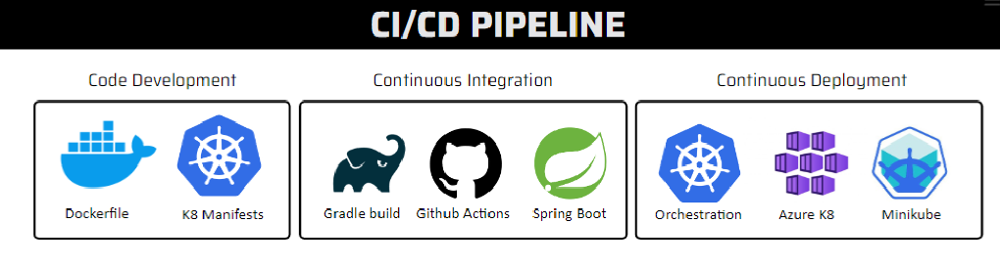

## Project Goal
This project involves the development of a chat application system using Spring Boot, Azure PostgreSQL cloud-hosted database, Gradle, Thymeleaf template engine, and WebSocket. The application is designed to be DevOps-friendly by utilizing CI/CD pipeline, GitHub Actions, Kubernetes manifests, Docker, Docker Compose, secrets management, and other DevOps tools. This project is part of the course "Continuous Integration and Continuous Delivery" at our faculty.


## Technologies

- **Spring Boot**: Framework for building applications with minimal configuration.
- **Azure Postgres**: Cloud-hosted database.
- **Gradle**: automation tool.
- **Thymeleaf**: Template engine for rendering web pages.
- **WebSocket**: Protocol for real-time communication.
- **CI/CD**: Continuous Integration and Continuous Delivery using GitHub Actions.
- **Kubernetes**: Container orchestration.
- **Docker**: Containerization of applications.
- **Docker Compose**: Define and manage multi-container Docker applications
  




## Install

1. Clone the repo:
```bash
git clone https://github.com/BeratAhmetaj/RT-Chat-KIII.git
docker build -t beratahmetaj/rt-chat-application:latest .
```

3. Start the containers
```bash
docker-compose up
```

## Detailed Explanation[MK] [Document](https://github.com/BeratAhmetaj/RT-Chat-KIII/blob/master/Realtime%20Chat%20-%20Continuous%20Integration_Continous%20Delivery.pdf)
  
